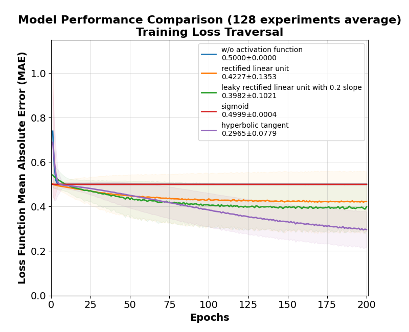
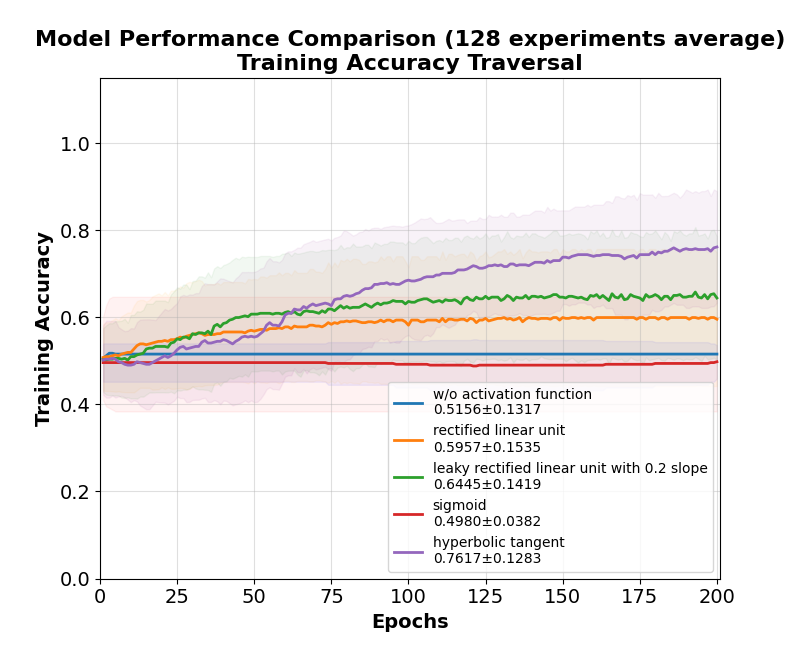
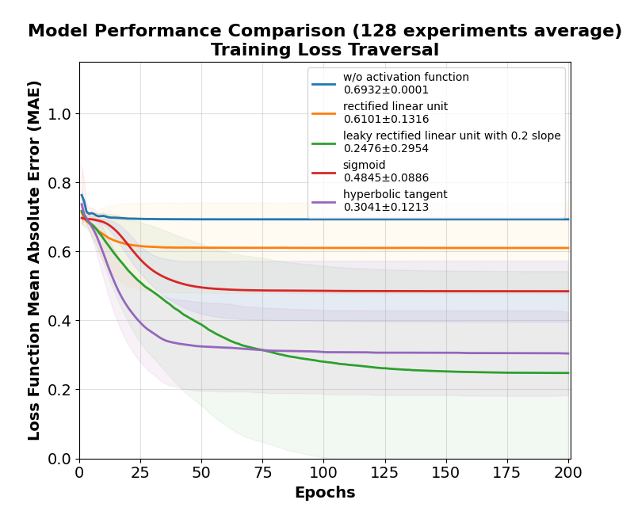
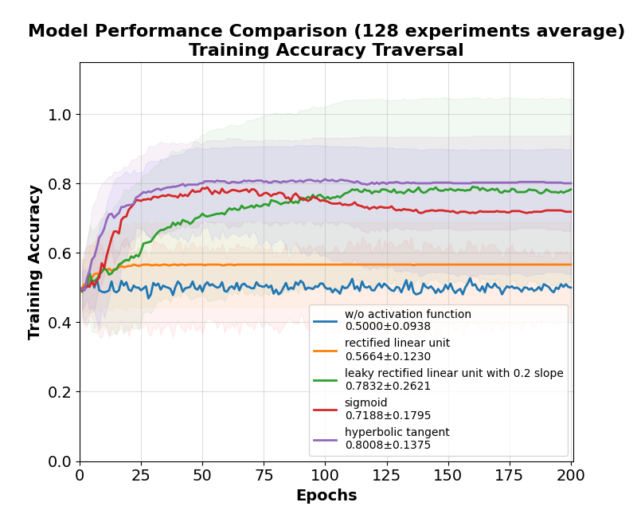
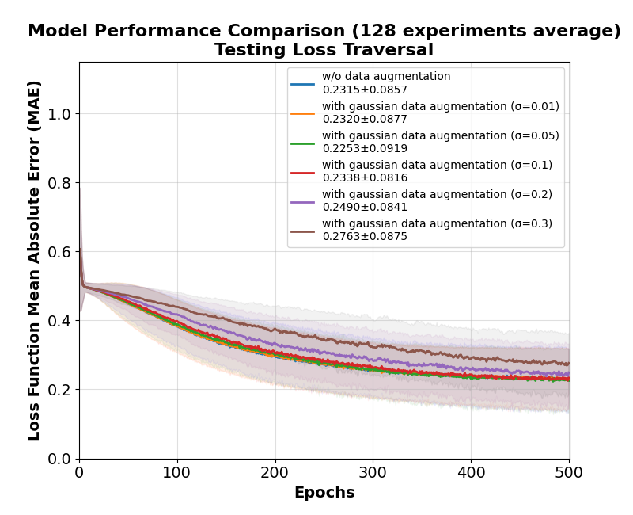
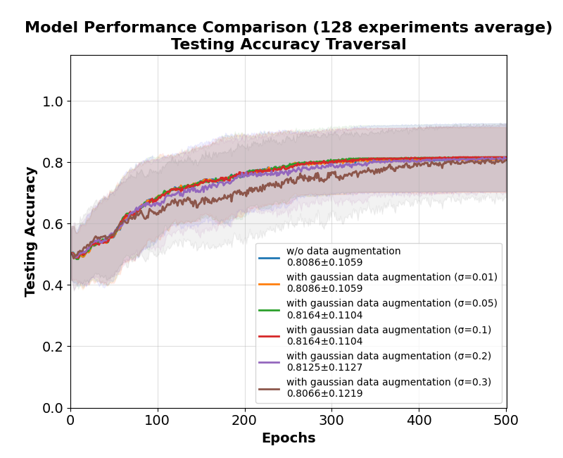

# XOR-DeepLearning

This is a Deep Learning course (NTNU Laboratory Training Experiment) using PyTorch.

---

## Experiment 1: Base Two-Layer XOR Model

Train a two-layer neural network on the XOR dataset using different activation functions:
* 128 experiment repeats
* 200 epochs
* w/o one hot encoding
* fix random seed (please reference experiemnt SET_SEED function)
* comparsion with None, Sigmoid, ReLU, LeakyReLU(slope = 0.2) and Tanh

  
  

- **Left**: Training loss traversal with different activation.  
- **Right**: Training accuracy traversal with different activation.  

---

## Experiment 2: One-Hot Encoding Comparison

Apply one-hot encoding to the targets and compare how the network learns under different activations:
* 128 experiment repeats
* 200 epochs
* w/ one hot encoding
* fix random seed (please reference experiemnt SET_SEED function)
* comparsion with None, Sigmoid, ReLU, LeakyReLU(slope = 0.2) and Tanh

  
  

- **Left**: Training loss traversal one-hot encoding with different activation.  
- **Right**: Training accuracy traversal one-hot encoding with different activation.  

---

## Experiment 3: Gaussian Input Data Augmentation (σ Comparison)

Add gaussian data augmentation to the inputs with varying standard deviations (σ):
* 128 experiment repeats
* 500 epochs
* w/o one hot encoding
* fix random seed (please reference experiemnt SET_SEED function)
* comparsion with sigma 0.01, 0.05, 0.1, 0.2, 0.3 and without augmentation
* activation function is Tanh

  
  

- **Left**: Training loss traversal with different gaussian sigma.  
- **Right**: Training accuracy traversal with different gaussian sigma.  
